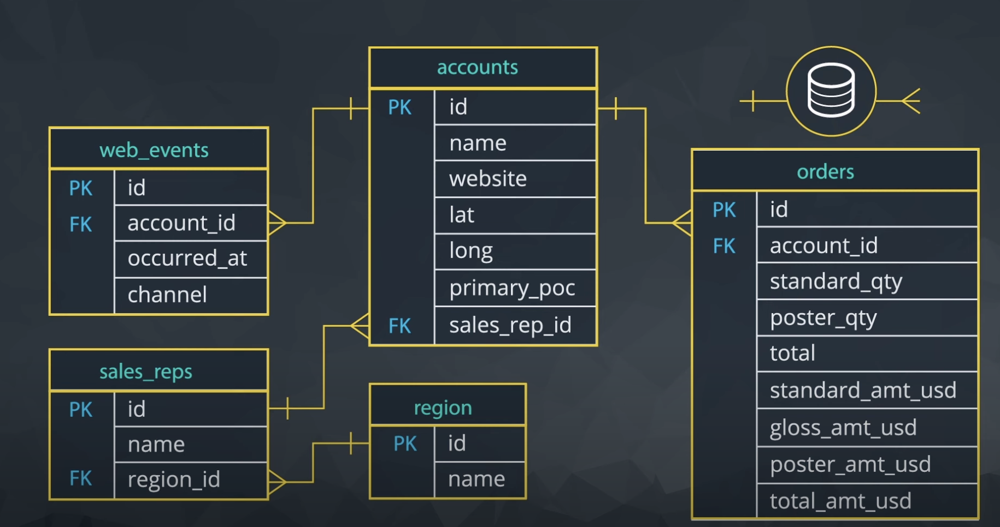

# ...

Example of ERD (entity Relationship Diagram)

Credits: Udacity

Relationships:

1. `account_id` in the `web_events` table is a foreign key linked to the `id` (primary key) in the `accounts` table.
2. `sales_rep_id` in the `accounts` table is a foreign key linked to the `id `(primary key) in the `sales_reps` table.
3. `account_id` in the `orders` table is a foreign key linked to the `id` (primary key) in the `accounts` table.
4. `region_id` in the `sales_reps` table is a foreign key linked to the `id` (primary key) in the `region` table.